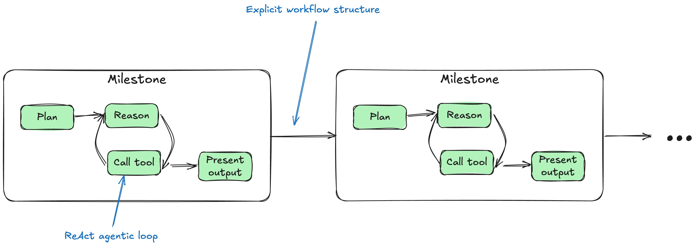

# Milestone Agent

## What is it?

An experiment that came out of wanting to make Portia more "agentic" and dynamic in its execution, whilst maintaining some of the existing value props of explicit & structured up front planning, controllable outputs, etc.

The idea is to have a PlanBuilder approach for defining the high-level plan as `Milestones` but then have a reason-acting (ReAct) agentic loop execute each milestone.

## Why?

1. There is a lot of power in reason-act (ReAct) in terms of flexibility and error handling. This approach is not as restrictive as current planning paradigm, but more controlled than pure agentic loop.
2. Milestones provide a natural way for business domain experts to reason about the progress of the agent in complex longer workflows. Hypothesis is that for most business use cases, an internal SME will have a mental model of the milestone to achieve a goal (first I do this, then I do that, if this goes wrong I do this)
3. Nicer for evals than purely agentic execution.
4. Easier to reason about and implement offramps: e.g. if there is no available calendar slot, end here.
5. Can mix and match milestones exeuction paradigms - some milestones might be executed as Agents, others as custom user code, others as Agentic workflows (i.e. current Portia).